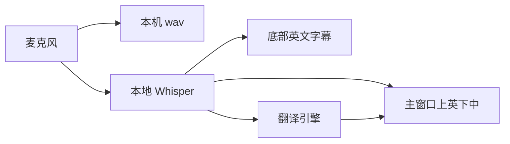
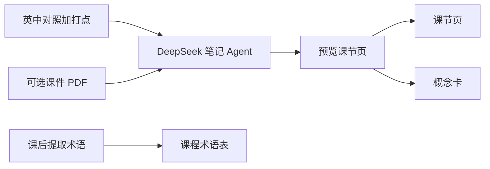

# 同传课堂

英文课用的本机桌面同传：麦克风进声，本地 Whisper 听英文，再译成中文。字幕、对照和录音都在你电脑上完成，不把录音送到云端识别。

本分支 **`feat/windows`** 是 **Windows 上课版**（只换置顶/点穿、字体、启动器等系统壳，识别和翻译与 Mac 相同）。macOS 请用默认分支 `main`。

## 课上长什么样

- **录制中**：主窗口上英文、下中文（译文可以慢几秒）；屏幕底部一条英文悬浮字幕，点得穿、不挡 PPT。
- **回看**：一句一块上英下中，双击回听。
- **课间用暂停**，不要点结束。
- **计入笔记**（可选，要 DeepSeek）：课节页记这堂怎么讲；概念卡跨课累积定义，给复习用。课上翻译吃的是课程术语表，不是概念卡。

## 这个项目做了什么

| 能力 | 做什么 |
|------|--------|
| 上课同传 | 麦克风 → 本地 Whisper → 翻译引擎 → 主窗口英中对照 + 底部英文字幕 |
| 课节管理 | 课程 / 课节、暂停与结束、打点、继续录制补到同一节 |
| 回看 | 一句一块、双击回听、搜索、全文、导出 Markdown、压缩录音、重补失败译文 |
| 术语表 | 课前手改或课后提取；喂给下一节课的识别和部分翻译，不是概念卡 |
| 计入笔记 | 可选。DeepSeek 整理后写入 Obsidian：课节页 + 跨课概念卡。也可让 Agent 改成你自己的笔记库 |

不做：上课改某一句译文、自动识别中英切换、用现成 wav 当麦克风再跑一遍、做成「下载即用」的安装包。也不要用 Cursor **云端 Agent** 装（那是 Ubuntu 虚拟机，装完打不开你电脑上的窗口）。

## 你需要准备

- **电脑**：Windows 10/11（本分支 `feat/windows`），或 macOS 13+（clone `main`）。**Python 3.11+**（Windows 推荐 3.11 / 3.12 64 位；Mac 系统自带 3.9 不够）。
- **本机 Cursor**（或同类能跑终端的助手），不要用网页/云端 Agent。
- **至少一种翻译凭证**（上课够用）。不要拷贝别人的 `.env` / `.venv` / `data/`。不要把 Key 发到聊天里：Agent 会建 `keys-inbox/`，你把文本放进去并标明哪家、哪一项。

| 引擎 | 你要准备 | 申请 |
|------|----------|------|
| DeepSeek | 只要 **API Key**（计入笔记才必须） | [控制台](https://platform.deepseek.com/usage) |
| 阿里百炼 | 只要 **API Key** | [百炼](https://bailian.console.aliyun.com) |
| 腾讯云机器翻译 | **SecretId + SecretKey** | [腾讯云 TMT](https://cloud.tencent.com/product/tmt) |
| 百度翻译 | **APP ID + Secret** | [百度开放平台](https://fanyi-api.baidu.com) |
| 阿里云机器翻译 | **AccessKey ID + AccessKey Secret** | [阿里机器翻译](https://www.aliyun.com/product/ai/alimt) |
| Ollama | 不用云 Key，本机/局域网起好模型 | `.env` 设 `TRANSLATE_PROVIDER=ollama` |

- **第一次识别会下载本地 Whisper 模型**（约数百 MB，缓存在用户目录，不进 Git）。需要联网；最好下课前先对着麦克风说几句。
- **笔记（可选）**：DeepSeek Key + 设置里选过 Obsidian 库。不用笔记不影响上课。

公开仓库，任何人都能克隆，**不要 `git push`**（只有仓库主人能推）。

## 同传怎么走

麦克风进声后，音频写在本机 `data/`，识别用本地 Whisper。字幕和对照都在你电脑上完成。



- **两条英文轨**：字幕用短窗、出字快，只显示最近一句、点得穿、不挡 PPT；主窗口用定稿窗（默认约 5 秒；「精准」加长并开 VAD），可以慢，但入库要准。
- **中文只跟定稿**：设置里的翻译引擎只管课上中文；英文识别始终是 Whisper。选了某引擎但没填 Key，会临时用已填写的其它引擎（不自动改成 Ollama，也不改本机设置）。录制中不能切换引擎。
- **术语表喂课上，不喂概念卡**：英文名会进识别热词；中英对照只进 DeepSeek / 百炼 / Ollama 的翻译提示。腾讯 / 百度 / 阿里机器翻译不吃术语表。
- **切窗**：上一句被腰斩时，先和下半句拼再译，避免半句乱译。
- **暂停 vs 结束**：暂停继续写 wav、不清课节；结束才收尾。课后可双击一句回听。「继续录制」是补录到同一节，不是课间休息。

## 笔记怎么走

笔记不是上课必需。只用同传、回看即可；不选 Obsidian 库，「计入笔记」写不进去，不影响录制。

默认这一套走 DeepSeek，写入你的 Obsidian（和设置里的课堂翻译引擎无关）。结构不合适、想接自己的笔记库或别的工具：可以让 Agent 改仓库里的笔记模块，甚至整段换成你自己的落库。下面只说明**仓库自带**的路径。



- **输入**：本课英中对照、打点、可选 PDF 摘录。课件只补结构/拼写；没讲的标成「课件提及、课上未展开」。寒暄、ASR 胡话丢掉。
- **两层落库**：课节页（`01-章节笔记/课堂-{课号}/第N节-标题.md`）组织这堂怎么讲；概念卡（`02-概念卡片/{中文名}.md`）跨课累积定义。已有卡只追加出现位置和要点，不覆盖「一句话」。同课程 `_概览.md` 追加链接。
- **预览才写入**：上方可改课节 Markdown；下方概念卡清单只能看新建/合并，改定义去 Obsidian。
- **术语表是第三条线**：给下一节课上翻译用。课后「从本课提取术语」，勾选后才进表（新建默认勾，改译默认不勾）。刚写完的这一节已经译完了，下一节才明显生效。

## 怎么开始

```bash
# Windows（本分支）
git clone -b feat/windows https://github.com/rehtd/course-translate.git

# macOS 仍用默认 main
# git clone https://github.com/rehtd/course-translate.git
```

在**本机** Cursor（或同类助手）里打开克隆下来的文件夹，把**下面整段**发给它。不要用云端 Agent。

不用 Agent：见 [docs/USAGE.md](docs/USAGE.md)。装好之后怎么点界面：见 [docs/AGENT_GUIDE.md](docs/AGENT_GUIDE.md)。系统壳：[docs/WINDOWS.md](docs/WINDOWS.md)。

### 本分支 feat/windows

功能跟 Mac 上课版对齐，只适配窗口置顶/点穿、字体、打开笔记、麦克风权限与启动器。Windows 双击 [启动同传课堂.vbs](启动同传课堂.vbs)（无黑框）或 [启动同传课堂.bat](启动同传课堂.bat)，不要用 `启动同传课堂.command` / `同传课堂.app`。

### 发给 Agent 的提示词（整段复制）

同一份也在 [docs/AGENT_PROMPT.md](docs/AGENT_PROMPT.md)。改这一段时两处一起改。

```
角色：编码助手。任务：按公开仓库在使用者面前这台电脑上部署「同传课堂」，并按仓库手册引导完成上课操作。不要用 Cursor 云端 Agent；终端即使显示 Linux 也是沙箱，不要按 Ubuntu 安装。

仓库：https://github.com/rehtd/course-translate.git
分支：Windows 必须用 feat/windows（git clone -b feat/windows https://github.com/rehtd/course-translate.git）。macOS 用 main。
范围：麦克风采集 → 本地 Whisper 识别 → 机器翻译 → 主窗口上英下中对照 + 底部英文悬浮字幕；课后可写入 Obsidian。feat/windows 只换系统壳，不要重写识别/翻译。

权威文档：
1. docs/USAGE.md — 环境、依赖、密钥、启动、麦克风授权
2. Windows 另见 docs/WINDOWS.md（仅 feat/windows 分支有）
3. 窗口可打开之后：docs/AGENT_GUIDE.md — 界面引导（先读操作总表）

策略：
- Git：禁止 git add .；禁止 git push。不要提交 .env、data/、录音、keys-inbox/。
- 密钥：不要让使用者把 Key 发到聊天里，也不要在对话中复述。在仓库创建 keys-inbox/（已 gitignore），写入说明.txt，列出各家要填什么、去哪申请。使用者在该文件夹放文本，写明哪份是哪家、哪一项。放好后告诉 Agent，Agent 只改 .env 对应行。用完可删 keys-inbox 里的密钥文件。
  各家字段（上课填一种即可；计入笔记才要 DeepSeek）：
  - DeepSeek：只要 API Key。https://platform.deepseek.com/usage
  - 阿里百炼：只要 API Key。https://bailian.console.aliyun.com
  - 腾讯云：SecretId + SecretKey。https://cloud.tencent.com/product/tmt
  - 百度：APP ID + Secret。https://fanyi-api.baidu.com
  - 阿里云机器翻译：AccessKey ID + AccessKey Secret。https://www.aliyun.com/product/ai/alimt
  - Ollama：不用云 Key，设 TRANSLATE_PROVIDER=ollama

执行顺序：
1. Windows 确认当前是 feat/windows。按 docs/USAGE.md 安装依赖。创建 keys-inbox/ 并写说明，等使用者放好密钥文本后再写入 .env、启动，直到主窗口可打开。
2. 按 docs/AGENT_GUIDE.md 引导界面操作（先读操作总表）。

引导约定：
- Agent 执行终端命令、说明按钮与下一步；点击界面、选择路径由使用者完成。
- 一次只给出一步，待使用者确认后再继续。
- 系统弹出麦克风授权时，提示使用者点「允许」。
- 课间引导暂停，不要结束。录制中不要引导切换课程、课节或翻译引擎。
- macOS：需要的话可做 Dock / 「启动同传课堂.command」入口；启动器不要提交进 Git，不要做成安装包。
- Windows：用仓库里的 启动同传课堂.vbs 或 .bat，不要另做安装包。
```

不要提交 `.env`、`data/`、录音、`keys-inbox/`；不要 `git add .`。课节和录音只在你电脑上的 `data/`（Git 忽略），换电脑不会自动带上。
