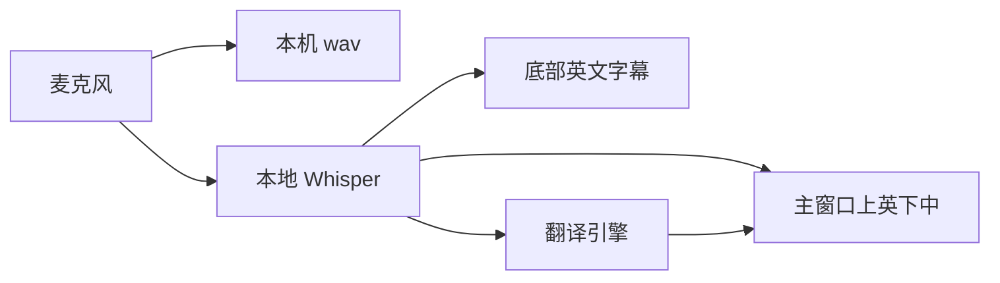
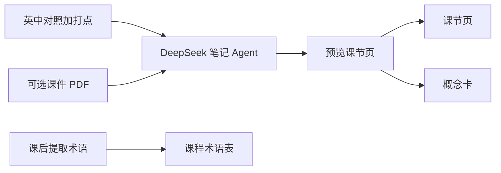

# 同传课堂

英文课用的本机桌面同传：麦克风进声，本地 Whisper 听英文，再译成中文。字幕和对照都在你电脑上完成，不把录音送到云端识别。

## 课上长什么样

- **录制中**：主窗口上英文、下中文（译文可以慢几秒）；屏幕底部一条英文悬浮字幕，点得穿、不挡 PPT。
- **回看**：一句一块上英下中，双击回听。
- **课间用暂停**，不要点结束。
- **计入笔记**（要 DeepSeek）：课节页记这堂怎么讲；概念卡跨课累积定义，给复习用。课上翻译吃的是课程术语表，不是概念卡。

## 同传怎么走

麦克风进声后，音频写在本机 `data/`，识别用本地 Whisper，不把录音送到云端。字幕和对照都在你电脑上完成。



- **两条英文轨**：字幕用短窗、出字快，只显示最近一句、点得穿、不挡 PPT；主窗口用定稿窗（默认约 5 秒；「精准」加长并开 VAD），可以慢，但入库要准。
- **中文只跟定稿**：设置里的翻译引擎只管课上中文；英文识别始终是 Whisper。选了某引擎但没填 Key，会临时用已填写的其它引擎（不自动改成 Ollama，也不改本机设置）。录制中不能切换引擎。
- **术语表喂课上，不喂概念卡**：英文名会进识别热词；中英对照只进 DeepSeek / 百炼 / Ollama 的翻译提示。腾讯 / 百度 / 阿里机器翻译不吃术语表。
- **切窗**：上一句被腰斩时，先和下半句拼再译，避免半句乱译。
- **暂停 vs 结束**：暂停继续写 wav、不清课节；结束才收尾。课后可双击一句回听。「继续录制」是补录到同一节，不是课间休息。

## 笔记怎么走

计入笔记走 DeepSeek，和设置里的课堂翻译引擎无关。需要先在设置里选过 Obsidian 库。



- **输入**：本课英中对照、打点、可选 PDF 摘录。课件只补结构/拼写；没讲的标成「课件提及、课上未展开」。寒暄、ASR 胡话丢掉。
- **两层落库**：课节页（`01-章节笔记/课堂-{课号}/第N节-标题.md`）组织这堂怎么讲；概念卡（`02-概念卡片/{中文名}.md`）跨课累积定义。已有卡只追加出现位置和要点，不覆盖「一句话」。同课程 `_概览.md` 追加链接。
- **预览才写入**：上方可改课节 Markdown；下方概念卡清单只能看新建/合并，改定义去 Obsidian。
- **术语表是第三条线**：给下一节课上翻译用。课后「从本课提取术语」，勾选后才进表（新建默认勾，改译默认不勾）。刚写完的这一节已经译完了，下一节才明显生效。

## 能做什么 / 不要指望什么

能：上课同传、课后回看、课程术语表、计入笔记。

不能：上课改某一句译文、自动识别中英切换、用现成 wav 当麦克风再跑一遍、把 Windows 当稳定上课机。也不是「下载即用」的安装包。

## 你需要准备

- **macOS 13+**，**Python 3.11+**（系统自带 3.9 不够）
- `.env` 里至少一种翻译 Key（腾讯 / 百度 / 阿里 / 百炼 / DeepSeek / 或本机 Ollama）。课后笔记才需要 DeepSeek。
- 不要拷贝别人的 `.env` / `.venv` / `data/`

公开仓库，任何人都能克隆，**不要 `git push`**（只有仓库主人能推）。

## 怎么开始

```bash
git clone https://github.com/rehtd/course-translate.git
```

把**下面整段**发给编码 Agent（Cursor、Claude Code、Copilot 等），让它按仓库文档安装并带着你点界面。

不用 Agent：见 [docs/USAGE.md](docs/USAGE.md)。装好之后怎么点界面：见 [docs/AGENT_GUIDE.md](docs/AGENT_GUIDE.md)。

### 发给 Agent 的提示词（整段复制）

同一份也在 [docs/AGENT_PROMPT.md](docs/AGENT_PROMPT.md)。改这一段时两处一起改。

```
角色：编码助手。任务：按公开仓库在本机部署「同传课堂」，并按仓库手册引导使用者完成上课操作。

仓库：https://github.com/rehtd/course-translate.git
范围：麦克风采集 → 本地 Whisper 识别 → 机器翻译 → 主窗口上英下中对照 + 底部英文悬浮字幕；课后可写入 Obsidian。

权威文档：
1. docs/USAGE.md — 环境、依赖、密钥、启动、麦克风授权
2. 窗口可打开之后：docs/AGENT_GUIDE.md — 界面引导（先读操作总表）

策略：
- Git：禁止 git add .；禁止 git push。不要提交 .env、data/、录音。
- 密钥：禁止在对话中复述。没让写就不要动 .env。

执行顺序：
1. 按 docs/USAGE.md 安装并启动，直到主窗口可打开。没让写 Key 就等使用者自己填。
2. 按 docs/AGENT_GUIDE.md 引导界面操作（先读操作总表）。

引导约定：
- Agent 执行终端命令、说明按钮与下一步；点击界面、选择路径由使用者完成。
- 一次只给出一步，待使用者确认后再继续。
- 系统弹出麦克风授权时，提示使用者点「允许」。
- 课间引导暂停，不要结束。录制中不要引导切换课程、课节或翻译引擎。
```

不要提交 `.env`、`data/`、录音；不要 `git add .`。课节和录音只在你电脑上的 `data/`（Git 忽略），换电脑不会自动带上。
